  

  Building <b>VEYLO</b>, my own VPN service: servers, clients, transports. 
  Also Telegram bots and games for Yandex Games.

 

<h3 align="center">Stack</h3>

  

 

<h3 align="center">Projects</h3>

  

 

<h3 align="center">Activity</h3>

  

  

 

<h3 align="center">Contact</h3>

  

