  

  Делаю свой VPN-сервис <b>VEYLO</b>: серверы, клиенты, транспорты. 
  Пишу Telegram-ботов и игры для Яндекс Игр.

  

 

<h3 align="center">Стек</h3>

  

 

<h3 align="center">Проекты</h3>

  

 

<h3 align="center">Активность</h3>

  

  

